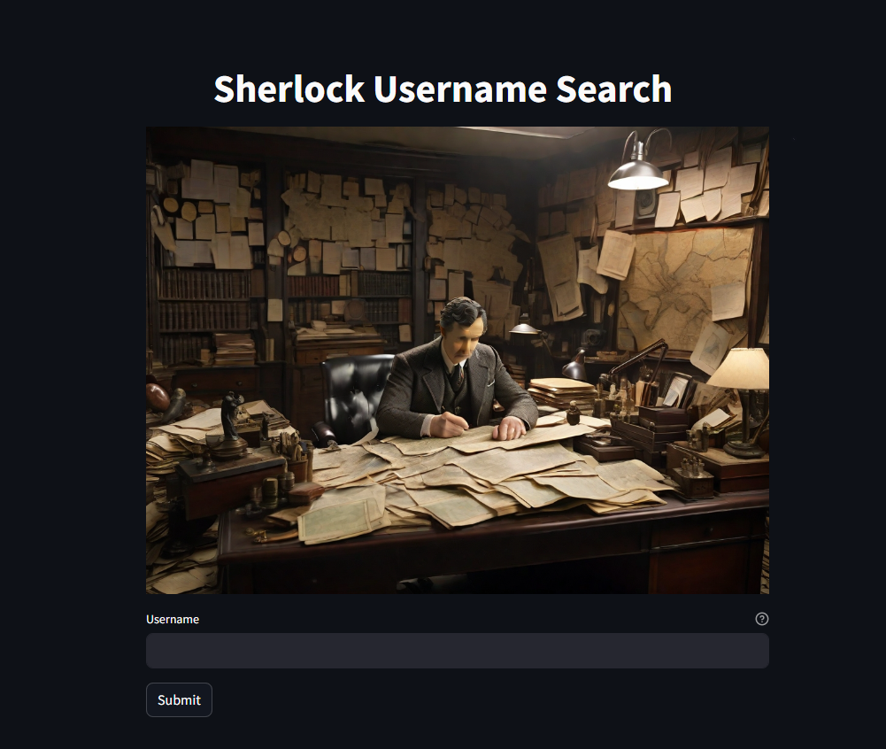
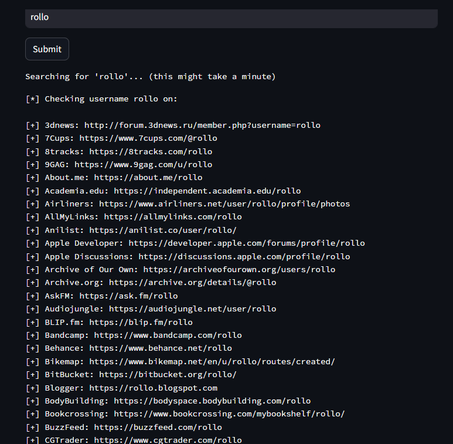

# Sherlock User Search App
Welcome to the Sherlock User Search App! This Streamlit application utilizes the Sherlock library to search for user nicknames or usernames provided by the user across various websites. It scans a database of web pages and returns all the pages where it found matching usernames.

## Try it

[Sherlock Streamlit page](https://sherlock.streamlit.app/)

## Prerequisites
Before you run the app, make sure you have the following prerequisites installed:

Python
Streamlit
Sherlock library

You can install the required packages using the following command:
```python
pip install streamlit sherlock
```


## How to Run the App
To run the app, use the following command in your terminal or command prompt:
```python
streamlit run app.py
```
##How to Use the App
Enter the username or nickname you want to search for in the input field provided.
Click on the "Search" button to initiate the search.
The app will scan the web pages and display a list of all the pages where it found matching usernames/nicknames.
Explore the search results and find relevant information about the user.
## Screenshots





Acknowledgments
Sherlock Repo: [Sherlock Project](https://github.com/sherlock-project/sherlock)

Happy searching! If you encounter any issues or have suggestions for improvement, feel free to open an issue or contribute to the development of this app.
